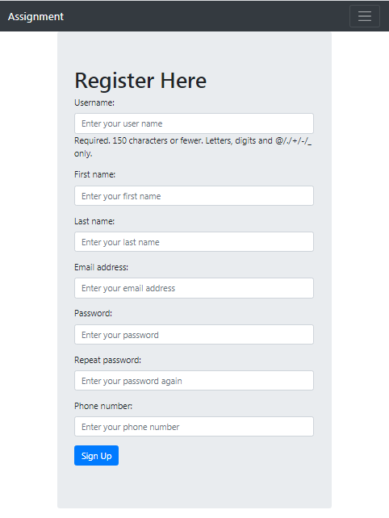
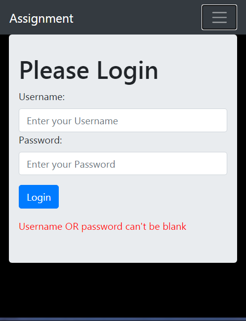
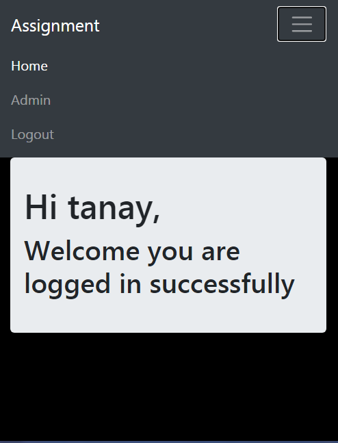

# Django Login and Signup

An example of Django project with basic user functionality.

## Screenshots

| Signup | User Already Exist | After Signup |
| -------|--------------|-----------------|
|  |  |  |

| login | After Logged in | Home |
| ---------------|------------------|-----------------|
|  |  |  |

## Functionality

- Log in
    - via username & password
- Create an account(signup)
- Log out if already logged in


## Installing

### Clone the project

```
git clone https://github.com/tanaychaulinsec/CloudxLabAssignment.git
cd CloudxLabAssignment 
```

### Install dependencies & activate virtualenv 
### To Serve Django Applications on Ubuntu 16.04(make sure your system already have python 3 before running below scripts , all the code and library in this project are based on Python 3.7, Dajngo webframework 3.1 and Bootstrap 4.5)

```
$ sudo apt-get update
$ sudo apt-get install python3-pip
$ sudo -H pip3 install --upgrade pip
$ sudo -H pip3 install virtualenv virtualenvwrapper
```
### If you are using Python 3 and the pip3 command, you will have to add an additional line to your shell initialization script as well:
```
$ echo "export VIRTUALENVWRAPPER_PYTHON=/usr/bin/python3" >> ~/.bashrc
```
### Regardless of which version of Python you are using, you need to run the following commands:
```
$ echo "export WORKON_HOME=~/Env" >> ~/.bashrc
$ echo "source /usr/local/bin/virtualenvwrapper.sh" >> ~/.bashrc
```
### Now, source your shell initialization script so that you can use this functionality in your current session:

$ source ~/.bashrc
### You should now have directory called Env in your home folder which will hold virtual environment information.

## Create Django Projects
#### Now that we have our virtual environment tools, we will create two virtual environments, install Django in each, and start two projects.

### Create the First Project
### We can create a virtual environment easily by using some commands that the virtualenvwrapper script makes available to us.

### Create your first virtual environment with the name of your first site or project by typing:
```
$ mkvirtualenv firstsite
```

#### This will create a virtual environment, install Python and pip within it, and activate the environment. Your prompt will change to indicate that you are now operating within your new virtual environment. It will look something like this: (firstsite)user@hostname:~$. The value in the parentheses is the name of your virtual environment. Any software installed through pip will now be installed into the virtual environment instead of on the global system. This allows us to isolate our packages on a per-project basis.

#### Our first step will be to install Django itself. We can use pip for this without sudo since we are installing this locally in our virtual environment:

```
(firstsite) $ pip install django
```


### Now install the library which I have used in my project

```
(firstsite) $ pip install bcrypt
(firstsite) $ pip install django[argon2]
(firstsite) $ pip install pylint-django
(firstsite) $ pip install django-phonenumber-field[phonenumberslite]
```

### After installing all the library go to project root 'CloudxLabAssignment' where manage.py file is situated

```
(firstsite) $ cd ~/CloudxLabAssignment
(firstsite) $ cd ~/CloudxLabAssignment
```

### Apply migrations

```
(firstsite) $ ~/CloudxLabAssignment/manage.py migrate
```

### I already created a superuser with this credential username:'tanay' password:'Test@1234' or you can create your own by using below script
(firstsite) $ ~/CloudxLabAssignment/manage.py createsuperuser

### Now run the server and check 

```
(firstsite) $ ~/CloudxLabAssignment/manage.py runserver
```

## Author
### Tanay Chauli 
### Email:-tanaychauli@gmail.com